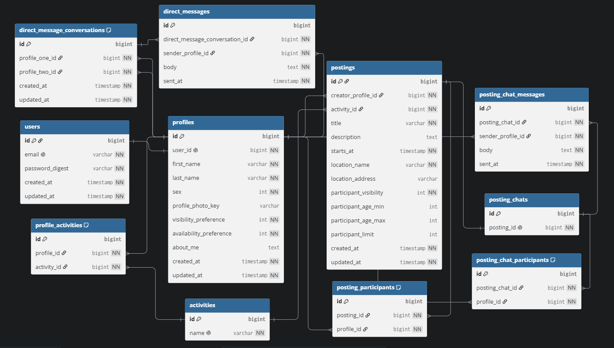

Squad Up V1 Database Architecture

**Version:** V1

**Database:** PostgreSQL

**Framework:** Ruby on Rails

This directory contains the database architecture for the Squad Up V1 application.

## Contents

- ERD diagram
- DBML source
- Entity Definitions
- Notes

### Entity Relationship Diagram 

### DBML Source

- [erd_v1.dbml](erd_v1_code.dbml)

### Entity Definitions

**User:**  
A user has exactly one profile. The `users` table stores authentication and validation information only.

**Profile:**  
A profile represents the user throughout the application and serves as the user-facing entity referenced by other domain tables.

**Posting:**  
A posting is a scheduled event created by one profile. A posting may be joined by many non-creator profiles and belongs to exactly one activity.

**Activity:**  
An activity is a catalog item representing something a profile may be interested in. A profile may select many activities, while each posting belongs to exactly one activity.

**Posting Participant:**  
A posting participant is a non-creator profile that has joined a posting. A profile may join many postings, and a posting may have many participants.

**Direct Message Conversation:**  
A direct-message conversation connects exactly two distinct profiles. Only one conversation may exist for any pair of profiles.

The profile pair must be treated as unordered. For example, `(7, 19)` and `(19, 7)` represent the same conversation and must not be stored as separate records. 

**Posting Chat:**  
A posting chat belongs to exactly one posting, and each posting may have only one posting chat. The posting creator is automatically included in the posting chat. Non-creator posting participants may opt into the chat.

**Posting Chat Participant:**  
A posting-chat participant is a profile that has opted into the chat associated with a posting. A non-creator profile must already be a participant in the posting before joining its posting chat. The posting creator is automatically included in the posting chat.

### Notes

Rule: A posting creator cannot join their own posting. 
In rails: 
validate :profile_cannot_be_posting_creator

def profile_cannot_be_posting_creator
  if profile_id == posting.creator_profile_id
    errors.add(:profile_id, "cannot join their own posting")
  end
end

Rule: A profile may only send a posting chat message if they are currently a participant in that posting chat.
In Rails:
validate :sender_must_be_posting_chat_participant

def sender_must_be_posting_chat_participant
  return if PostingChatParticipant.exists?(
    posting_chat_id: posting_chat_id,
    profile_id: sender_profile_id
  )

  errors.add(
    :sender_profile_id,
    "must be a participant in the posting chat"
  )
end

Major Query Pages

- Discover
- Posting Board
- My Postings
- Inbox
